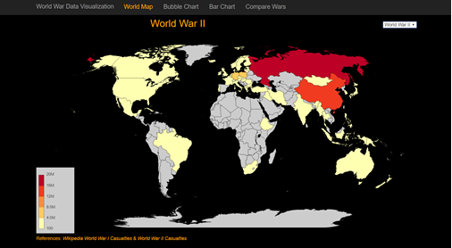
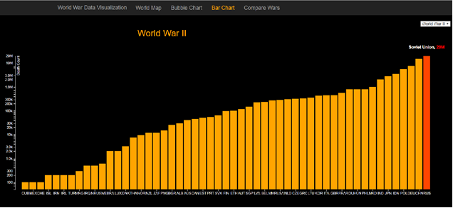
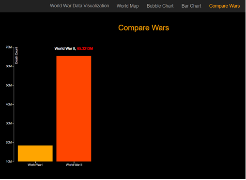

# World War I and II Data Visualization
 
**Introduction:** Wars are bad, simply because the massive devastation it creates in human life and the after effects is more than horrible. We saw two of the biggest war in the history of mankind; World War I and World War II. These two wars killed millions of people across the world and had a severe effect even when the war was over. More than 25 countries were involved in world war 1 and more than 58 countries in world war II. 
 
In this project, I would like to represent the loss of human life across the world during these 2 wars. We will visualize the damage and see how horrible the wars are. We will see which countries were involved and which countries were affected the most. We will also find out that some countries like India, Australia etc. though apart from the actual battle field were still involved. Lastly, we will do a simple comparison of the two war.


## Running the code on Local Machine: 
 
Copy the source code folder ‘src’ from loop. 2. Install Python latest version if not available. (Make sure to select the check box to add python to PATH variables). 3. Navigate to folder ‘src’ on local machine. 4. Run command ‘python –m http.server 8888 &’ (without quotes and make sure no other website is running on port 888). 5. Open Chrome browser and navigate to URL ‘http://localhost:8888/cover.html’. 


## Source: Wikipedia. 
 
World war casualties’ details is actually only available in Wikipedia with complete details and also without any hassle. Many big visualization project like http://fallen.io/ww2 have referred this dataset and we can assume that this dataset is fairly reliable, though there are little discrepancies. Outlining such discrepancies is out of scope of this project. 
 
## Datasets: 
 
1. **World War 1:** This data set was manually copied from Wikipedia and then edited in Google Fusion Table. Firstly, the unwanted national flags were removed manually using an excel sheet. Then the data was imported to google fusion table and following processes/operations were carried out in fusion table: a. Geo Coding all the countries. b. Adding the Geo Code columns. c. Removing blank entries. d. Formatting the numbers to remove the unwanted commas from the deaths count. e. Removing unnecessary columns not required for analysis. f. Downloaded to local machine. 
 
2. **World War 2:** An itemized list of data entries was referred from the fusion table from fallen.io. Following processes/operations were carried out in fusion table: a. Did summarization per country and deaths count. 
b. Doing a sum of deaths count per country. In this table we had multiple entries for single country. E.g. Entry for United States was present 67 times. The sum function helped to create only 1 row entry per country. c. Geo Coding all the countries. d. Adding the Geo Code column. e. Fixing the death count number format. f. Removing blank entries and data. g. Removing unnecessary columns not required for analysis. h. Downloaded to local machine. 
 
3. **Compare World War I and II:** Manually created this csv which contains only the total death count of both wars. 
 
4. **TOPOJSON:** Contains Geo code data. Downloaded from https://github.com/topojson/topojson  
  
 
## Visualizations 
 
1. **World Map** Visualizes the death count per country on a world map. 5 color variation of ‘YlOrRd’ from color brewer was used to represent the density of death count. Light orange being comparatively low and red being extremely high. To format the death count, d3 function ‘format’ was used with setting ‘.2s’, which converts the count to thousands (K), millions (M) and etc. On hovering any of the region, we can see the country name and the death count. Also, applied an animation so that colors appears gradually giving a nice look. Added the legend on the left side of the map explaining the color scale. There is an option to switch the world map between world war I and II. 
 
**Screenshot**


 
 
2. **Bubble Chart** Visualizes the death count for each country using circles. The radius of the circle represents the relative death count. Bigger circle represents large death count. D3.schemeCategory20c was applied which selects 20 random color and assigns to countries. The circle has a text at center which represents the 3 digit ISO country code. This was done as for smaller circles it was difficult to put the entire name of a country.  Although, on hover we can see the complete country name and also the exact death count. There is an option to switch the bubble chart between world war I and II. 
 
**Screenshot**
 

 
 
3. **Bar Chart** Visualizes the death count for each country using bars. X axis represents the 3 digit ISO country code and Y axis represents the death count. Log scale was use to represent the y axis death count, as for some countries the count was as small as 200 and for some it was in millions. The below function from d3 was used to scale the y axis: 

```javascript
var y = d3.scaleLog().rangeRound([height, 0]).domain([50, d3.max(data, function (d) { return d.Deaths; })]); 
```

Tool tip is available on hovering any of the bar. The tool tip displays the country name and the death count formatted in thousands (K), millions (M) etc. There is an option to switch the bar chart between world war I and II. 
 
 
**Screenshot**
 

 
 
4. **Compare Wars** Compares the two war death count. This is a simple bar chart but still handy to see the vast difference in the effect of world war I and II. 
 
**Screenshot**


 
## Result 
 
With the help of this project we visualized the effect of world war on countries, regions and even continent. It is quite clear from the world map that how Europe was the most effected in both world wars and how continent like Africa, North America, Middle East were not. The project also helps to visualize the effect and involvement of some countries like India, Australia, New Zeeland, though they were way apart from the battle field. The reason could be different for each country in this case, like for India it was because of British Empire ruling India during both wars and many soldiers travelled away from India for the war. 
 
More than 18.5 Million people (military + civilians) were killed in world war I and more than 65.3 Million people (military + civilians) were killed in world war II. Total around 83 Million people were killed which is much more than summing all the wars deaths which happened on earth. 